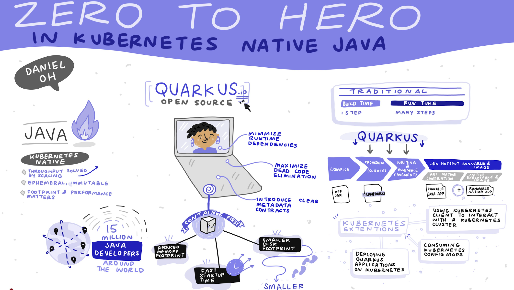

I'm a Senior Principal Technical Marketing Manager at Red Hat, a well-known public speaker, open source contributor, published author, and developer advocate. I'm more than 20 years of first-hand experience in solving real-world enterprise problems in production environments using cloud-native technologies such as [Quarkus](https://quarkus.io/), [Spring Boot](https://spring.io/projects/spring-boot), [Node.js](https://nodejs.org/), and [Kubernetes](https://kubernetes.io/). 

I'm also reponsible for a [Cloud Native Computing Foundation (CNCF) ambassador](https://www.cncf.io/people/ambassadors/) and [DevOps Institute ambassador](https://www.devopsinstitute.com/about-us/ambassadors/) to evangelize developers and operators in terms of developing cloud-native microservices, designing serverless functions, and deploying them to multi- and hybrid clouds in flexible, easy-to-use, cost-effective, open, and collaborative ways.

Find me here:
- Youtube: [bit.ly/danielohtv](https://www.youtube.com/channel/UCL0q0BtIDkOhTCMdtwNgLBg)
- Twitter: [@danieloh30](https://twitter.com/danieloh30)
- LinkedIn: [daniel-oh-083818112](https://www.linkedin.com/in/daniel-oh-083818112/)
